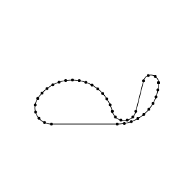

# round-polygon

Small, typed, dependency-free tool to round corners of an arbitrary polygon provided by an array of `{ x, y }` points.

The algorithm prevents rounding overlaps, so if you pass an oversized radius, it won't break the shape, but instead calculate the maximum radius of each point, just like you expect.


###  [Demo page](https://foretoo.github.io/round-polygon)
<br/>

## Installation

by npm:
```
npm i round-polygon
```
and then
```javascript
import roundPolygon from "round-polygon"
```
or if you don't use npm you can import module from unpkg:
```javascript
import roundPolygon from "https://unpkg.com/round-polygon@latest/dist/round-polygon.es.js"
```
or by script tag (with a link to IIFE module, which pollutes global scope with roundPolygon and getSegments functions) in your html page:
```html
<script src="https://unpkg.com/round-polygon@latest/dist/round-polygon.iife.js"></script> 
```

## Usage

### Types
if you use TypeScript you can also import input type "InitPoint" and output type "RoundedPoint"

```javascript
import roundPolygon, { InitPoint, RoundedPoint } from "round-polygon"

let polygonToRound: InitPoint[],
    roundedPolygon: RoundedPoint[],
    radius: number
```

### Input
roundPolygon function takes two arguments: an array of initial points and a radius

```javascript
polygonToRound = [
  { x: 100, y:   0 },
  { x:   0, y: 150 },
  { x: 200, y: 150 },
  { x: 200, y:   0 },
  { x: 150, y: 200 },
]

radius = 20

roundedPolygon = roundPolygon(polygonToRound, radius)
```
To set a certain radius for a certain point, just add "r" property to the initial point. The radius passed as the argument to the function won't affect these points. Keep in mind that the algorithm rounds these points with higher priority.
```javascript
{ x: 100, y: 0, r: 50 }
```
### Output
a rounded point is an object with provided properties:

```javascript
{
  id: number, // index of the current point
  x: number, // x-coordinate of the initial point
  y: number, // y-coordinate of the initial point
  offset: number, // length between the initial point and the start or the end of a rounding arc
  angle: { // in radians
    main: number, // the angle between the previous point, the current one, and the next one
    prev: number, // the angle between prev-to-curr-line to x-Axis
    next: number, // the angle between next-to-curr-line to x-Axis
    bis: number, // the bisector angle to x-Axis
    dir: 1 | -1 // whether clockwise (1) or counter-clockwise (-1) is the main angle direction (from the "prev" to the "next" angle)
  },
  arc: {
    radius: number, // the rounding radius of the current point (might be less then provided as an argument (caused by rounding overlapping))
    x: number, // x-coordinate of rounding center
    y: number // y-coordinate of rounding center
  },
  in: {
    length: number, // the length of prev-to-curr-line
    x: number, // x-coordinate where the arc begins laying on prev-to-curr-line
    y: number // y-coordinate where the arc begins laying on prev-to-curr-line
  },
  out: {
    length: number, // the length of next-to-curr-line
    x: number, // x-coordinate where arc ends laying on next-to-curr-line
    y: number // y-coordinate where arc ends laying on next-to-curr-line
  },
  prev: {...}, // a getter, returns prev-indexed rounded point
  next: {...} // a getter, returns next-indexed rounded point
}
```
### Segments

You might need the rounded polygon provided with only `{ x, y }` points, so every arc should be divided by segments of stright lines. Given `getSegments` function does that, it calculates coordinates of segmented arcs points. It takes array of rounded points, type of arc division (by `LENGTH` of segments or by `AMOUNT` of points) and a value to divide by corresponded to this type. It returns an array of `{ x, y }` points.

```typescript
import roundPolygon, { getSegments, Point } from "round-polygon"

let segments: Point[]

roundedPolygon = roundPolygon(polygonToRound, radius)
segments = getSegments(roundedPolygon, "LENGTH", 20)
```
### Summary
so the whole approach to draw a rounded shape using, for example, Canvas API looks like this:

```javascript
// init
const
  canvas = document.querySelector("canvas"),
  ctx = canvas.getContext("2d"),
  polygonToRound = [
    { x: 100, y:   0, r: 60 },
    { x:   0, y: 150 },
    { x: 200, y: 150, r: 60 },
    { x: 200, y:   0 },
    { x: 150, y: 200 },
  ],
  radius = 1000,
  roundedPolygon = roundPolygon(polygonToRound, radius),
  segments = getSegments(roundedPolygon, "LENGTH", 10)

// draw rounded shape
ctx.beginPath()
roundedPolygon.forEach((p, i) => {
  !i && ctx.moveTo(p.in.x, p.in.y)
  ctx.arcTo(p.x, p.y, p.out.x, p.out.y, p.arc.radius)
  ctx.lineTo(p.next.in.x, p.next.in.y)
})
ctx.stroke()

// draw segments of rounded shape
segments.forEach((p) => {
  ctx.beginPath()
  ctx.arc(p.x, p.y, 2, 0, Math.PI*2)
  ctx.fill()
})
```


## Changelog

### v0.6.7
- fix: getting NaN's by `getSegments` on some edge cases

### v0.6.6
- add `getSegments` utilite to calculate segments of rounded corner arc
- cleaner code

### v0.6.4
- common radius doesn't affect init-points with "r" = 0
- handle points overlapping, 0/PI radians main-angle point

### v0.6.0
- added ability to provide a certain radius to a certain Point
- some bugs fixed
### v0.5.9
- performance improvement (clean code)
### v0.5.1
- first stable version

### Upcoming
- input and output might be SVG path
- provide bezier curve estimations as an alternative to an arc output property